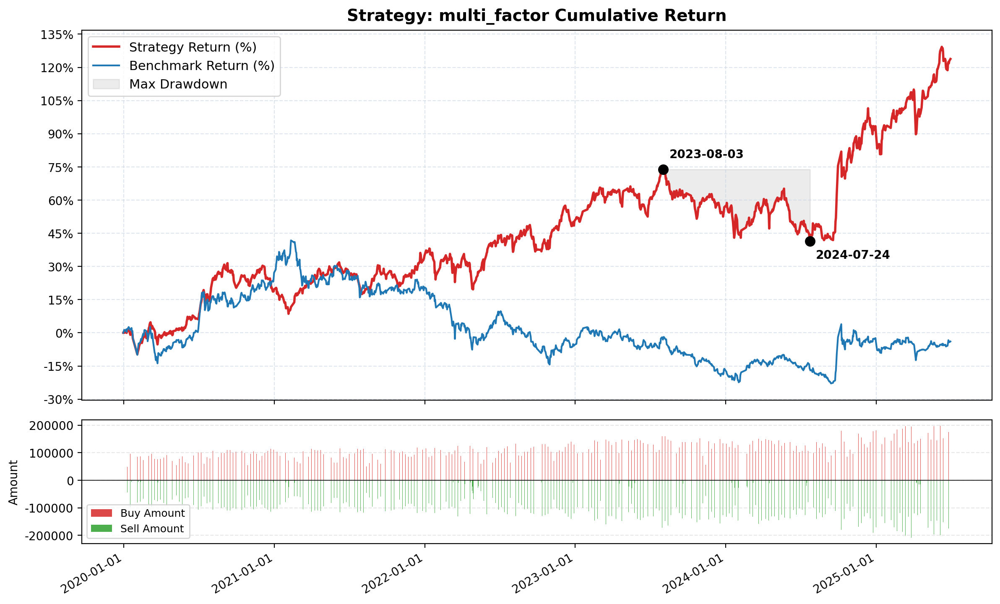

# Stock Policy

A 股量化投研工具链——行情数据采集、技术指标计算、多股回测、新闻采集。

## 环境准备

### 1. 安装 uv（Python 包管理器）

```bash
# Windows (PowerShell)
powershell -c "irm https://astral.sh/uv/install.ps1 | iex"

# macOS / Linux
curl -LsSf https://astral.sh/uv/install.sh | sh
```

### 2. 安装依赖

```bash
uv sync
uv run playwright install chromium
```

### 3. 配置 API Token

```bash
cp config.example.py config.py
```

编辑 `config.py`，填入你的 API Token：

```python
TUSHARE_TOKEN = os.environ.get("TUSHARE_TOKEN", "你的Tushare Token")
BOCHA_API_KEY = os.environ.get("BOCHA_API_KEY", "你的博查AI Key") 
DEEPSEEK_API_KEY = os.environ.get("DEEPSEEK_API_KEY", "你的DeepSeek Key")
```

- **Tushare**：注册 https://tushare.pro ，获取 Token（需积分 >= 2000 才能调用 `stk_factor_pro` 接口）
- **博查 AI**：注册 https://open.bochaai.com ，获取 API Key（新闻搜索用，可选，不使用此，使用新闻爬虫的效果更好）
- **DeepSeek**：注册 https://deepseek.com ，获取 API Key（AI 预测用，可选）

### 4. 导出股票列表（可选）

```bash
uv run python export_all_stocks.py   # 生成 a_shares_list.csv
uv run python export_etfs.py         # 生成 etf_list.csv
```

### 5. 配置 Claude 及 MCP/Skill 环境（智能预测必需）

智能预测系统 (`agent_predict.py`) 会调度 DeepSeek 负责核心推演，并直接唤起本地的 Claude 执行终端命令和获取数据。为了让系统正常运作，必须提前完成以下配置：
1. **安装 Claude Code**: 确保本地已全局安装 `claude` 命令行工具（如 `npm install -g @anthropic-ai/claude-code`）。
2. **配置 Tushare MCP / Skills**: 确保在你的 Claude Code 中安装并配置了 `tusharemcp`，或者配置了项目中 `.agents/skills/tushare` 的专属 Skill，以便 Claude 能够随时调用 Tushare 接口查数据。
3. **配置 API Key**: 在 `config.py` 或环境变量中务必填入 `DEEPSEEK_API_KEY`（作为思考大脑）以及 Claude Code 自身的 Anthropic Key。

---

## 功能模块

### 行情数据

下载全量 A 股 / ETF / 指数日线数据（含 200+ 技术因子）：

```bash
uv run python data_manager/download_stk.py       # A 股日线
uv run python data_manager/download_etf.py       # ETF 日线
uv run python data_manager/download_idx.py       # 指数日线
```

下载完成后构建 HDF5（供回测引擎使用）：

```bash
uv run python data_manager/recalc_qfq.py          # 重算前复权
uv run python data_manager/scripts/build_hdf5.py  # 股票 CSV → HDF5
uv run python data_manager/scripts/build_etf_hdf5.py  # ETF CSV → HDF5
```

数据存储结构：

```
data_manager/data/
├── stk/raw/              # 每只 A 股一个 CSV
├── stk/raw_h5/           # HDF5 合并包
├── etf/raw/              # 每只 ETF 一个 CSV
├── etf/raw_h5/           # ETF HDF5 包
└── idx/raw/              # 指数 CSV
```

### 回测

```bash
# 多因子均值回归策略（推荐，2020-2025 超额 +127%）
uv run python data_manager/backtest/strategy/strategy_multi_factor.py

# QFQ 指标使用演示（展示如何正确使用前复权数据）
uv run python data_manager/backtest/strategy/strategy_qfq_demo.py

# 多股均线金叉/死叉策略
uv run python data_manager/backtest/run_multi_backtest.py

# 单股均线策略（平安银行 000001）
uv run python data_manager/backtest/strategy/strategy_ma.py

# 小市值轮动策略
uv run python data_manager/backtest/strategy/strategy_smallgo.py

# ETF RSRS+动量轮动策略
uv run python data_manager/backtest/strategy/etf_rotation.py
```

回测输出（每轮运行生成时间戳目录）：

```
data_manager/backtest/log/<策略名>/<时间戳>/
├── report.md              # 收益/回撤/夏普统计
├── transactions.csv       # 逐笔买卖流水
├── trades.csv             # 平仓记录
└── return_curve_with_trades.png  # 收益曲线图
```

引擎特性：
- T+1 开盘价成交，整手（100 股）取整
- 双边佣金 + 印花税（0.03%）
- 先卖后买释放现金，逐笔现金校验
- 与 JoinQuant 结果对比验证（误差 < 0.1%）

---

## 使用 AI Agent 编写与迭代策略

本项目支持通过 Claude Code（或其他兼容 AI Agent）自动编写、回测、迭代量化策略。

### 前置准备

1. 安装 [Claude Code](https://docs.anthropic.com/en/docs/claude-code)
2. 将本项目克隆为 Claude Code 工作目录
3. Agent 会自动读取 `CLAUDE.md`（项目指令）和 `STRATEGY_MANUAL.md`（策略手册）

### 第一次使用

打开 Claude Code 后，直接说出你的策略想法，Agent 会：

1. **参考策略手册**：自动读取 `data_manager/backtest/strategy/STRATEGY_MANUAL.md`，了解引擎 API、可用数据列、指标函数、常见陷阱
2. **编写策略代码**：在 `data_manager/backtest/strategy/` 下生成策略文件
3. **运行回测**：`uv run python` 执行回测，打印收益/夏普/回撤
4. **迭代优化**：根据回测结果调整因子权重、参数、过滤条件
5. **记录经验**：错误自动写入 `.claude/memory/gotchas.md`，策略发现写入 `.claude/memory/strategy_research.md`

### 策略编写示例

```
> 帮我写一个基于低换手率 + 低PB + 小市值的多因子策略，
  持仓 20 只，每 10 天调仓，2020-2025 年回测
```

Agent 会：
- 阅读手册了解 `today_data` 可用列（`turnover_rate`, `pb`, `circ_mv`, `bias1_qfq` 等）
- 过滤股票池（PE > 0, 非跌停, 流通市值 > 30亿）
- 横截面百分位排名打分（注意：价格衍生指标必须用 `_qfq` 列）
- 生成买卖订单（卖出不在 top 缓冲区的持仓，等权买入新人选）
- 运行回测并输出报告

### 关键约束

Agent 在编写策略时自动遵守以下规则：

| 规则 | 说明 |
|------|------|
| **qfq 横截面** | 多股票排名打分必须用 `_qfq` 列（前复权），`_bfq` 列（不复权）仅用于存储 |
| **QFQ 止损** | 绝对价格阈值必须用 `engine.get_history_qfq()` |
| **无未来函数** | T+1 开盘价成交，策略只看到当日收盘数据 |
| **回测区间** | 默认 2020-2025 年中，覆盖完整牛熊周期 |
| **TDD** | 所有纯逻辑函数必须有 pytest，失败先记录 gotchas |

### 策略迭代流程

```
想法 → Agent 写策略 → uv run 回测 → 看报告
                                      ↓
                              不理想 → 分析因子 IC/IR
                                      ↓
                              Agent 调整参数/因子
                                      ↓
                              满意 → 记录到 strategy_research.md
```

详细参考：
- 策略 API：`data_manager/backtest/strategy/STRATEGY_MANUAL.md`
- AI 可读项目说明：`readme_ai.md` 

### 展示一个由 Agent 编写并迭代的策略回测结果：


---

### 新闻采集

```bash
# 韭研公社盘前纪要（工作日每日更新）
uv run python news_manager/jiuyangongshe_scraper.py --latest
uv run python news_manager/jiuyangongshe_scraper.py --date 20260526

# 同花顺个股新闻（自动抓取近 4 个交易日全文）
uv run python news_manager/stocknews_scraper.py list --code 600410
uv run python news_manager/stocknews_scraper.py list --code 600410 --fetch-days 7

# 博查 AI 搜索 + 全文抓取
uv run python news_manager/bocha_scraper.py --code 600410
uv run python news_manager/bocha_scraper.py --code 600410 --days 5
```

新闻数据存储：

```
news_manager/data/
├── jygs/pqjy/<YYYYMMDD>/       # 韭研公社文章 + 图片
├── stk/raw_ths/<code>/         # 同花顺新闻列表 + 全文
└── stk/raw_Bocha/<code>/       # 博查搜索结果 + 全文
```

---

## AI 智能预测与复盘系统 (Agent Predict)

`agent_predict.py` 是本项目的核心量化事件驱动智能预测模块。它通过**双核 Agent 协同**（DeepSeek 负责逻辑推演，Claude 负责工具调用）来完成多标的行情推演及历史打分复盘。

### 运行方式

```bash
uv run python agent_predict.py --stk 000001 000002 --etf 510300 --idx 000001
```

### 整体工作流程

系统每天围绕具体的股票标的，分为 **预测阶段** 与 **复盘阶段** 自动流转：

1. **信息收集 (Python 主控)**
   - 自动运行爬虫抓取目标标的最新新闻（如同花顺新闻摘要等）。
   - 获取实时 Tick 数据作为最新收盘/盘中快照。
   - 根据交易日历，自动计算该标的 1日、3日、5日 后的预测目标交易日。

2. **双核推演预测**
   - **DeepSeek (思考大脑)**：读取实时新闻、Tick 数据、过去累积的“历史复盘经验库”，并生成数据查询指令（通过特定的 `<claude>` 标签发出）。
   - **Claude (工具手)**：作为子进程在无沙箱模式下被唤起，接收 DeepSeek 的指令，在本地免授权调用 Tushare MCP 或 Python 脚本查询日线、财务、资金流向等数据。
   - **数据桥接循环**：Claude 抓取的数据会直接写入本地 `.csv` 文件，同时通过生成 `_query_meta.json` 告知主系统。主系统读取后，将截获的真实数据和工具执行记录回调反馈给 DeepSeek 继续思考，直到 DeepSeek 认为获取了足够的信息（目前设置最多5轮拿取数据，可以根据需要调整）。
   - **结论输出**：DeepSeek 最终输出标准化的预测结论（必须包含方向、若无公式计算则精度为0.5%步长，或只能为整数的涨跌幅区间、0-10之间为整数的信心打分、核心逻辑和应对方式）。

3. **动态复盘验证**
   - 每次运行系统时，会自动向前回溯验证刚好到期（1日/3日/5日期限到达 T 日）的预测。系统会自动识别最近一个有完整收盘数据的交易日作为 T 日（19:00 后运行为当日，否则为前一交易日）。
   - 对比真实行情数据，判断预测方向和涨跌幅区间是否准确。
   - 将正确/错误的经验、原推演逻辑、实盘验证结果重新喂给大模型，让大模型自己反思并更新到专属的“复盘知识库” (`predict_ex_*.md`) 中。明天的推演会自动挂载这份知识库，从而避开同样的坑（如：未考虑分红除权、假突破骗炮等）。

### 【重要】数据通信与输出纪律

在双 Agent 协同机制中，我们制定了极度严格的数据通信规则（已内置于系统 Prompt）：
- **禁止废话与 Markdown 汇报**：系统明确禁止 DeepSeek 要求 Claude 生成任何形式的总结报告或 Markdown 文件（如自行发明的 `_workflow.md` 等），并且只允许 Claude 通过终端文本输出或 CSV 沟通。这能极大节省 Token 消耗并避免无意义的工具调用拖慢速度。
- **强制 CSV 桥接**：遇到长序列数据，大模型强制要求 Claude 将数据写入 `.csv` 文件，并在工作目录生成 `_query_meta.json` 记录文件名，Python 主程序会自动拦截并解析，避免在终端输出超长字符串导致崩溃。

### 时间点与周期逻辑

系统在设计时充分考虑了 A 股市场的交易机制和信息发酵周期，内置了极其严格的“时间锚点”防漏错机制：

1. **预测基准日 (`data_td`)**：
   - **盘中/非交易日**（如 14:30 或 周末）：系统会自动取**上一个交易日**的收盘数据作为基准起点来推演未来（对于盘中则是推演当天交易日收盘，对于非交易日则是推演下一个交易日收盘）。
   - **盘后**（15:00 之后）：系统认定当日的收盘数据已落定，将**今日**作为基准推演。
   - **`_nowind` 信息盲区排除**：在 `15:00 ~ 19:00` 期间生成的预测会被打上 `_nowind` 后缀标签。因为这段时间虽然股市收盘了，但Tushare大部分数据没有更新，此时的预测存在极大的信息盲区。**系统在复盘时会自动完美剔除所有带有 `_nowind` 标签的预测**。
   - **注意**  无论是盘中、盘后还是非交易日，预测目标的基准**永远**是“最新收盘数据对应的交易日(data_td)”  
     (即前一日19点到今日15点预测的目标是今日交易日收盘，15点-19点预测明日但不会进入复盘，19点到明日15点预测的是明日交易日收盘，以此类推)

2. **复盘截止日 (`T` 日)**：
   - 只有在每天的 **19:00 之后**，Tushare才可以拿到大部分当天的交易数据。
   - 因此，无论你何时运行代码，系统都会执行复盘。但如果你在 19:00 之前运行，复盘引擎会将可验证的 `T` 日退回到**上一个交易日**的收盘。
   - **防重复刷屏**：无论周末你运行多少次脚本，只要新的交易日还没到 19:00，系统都会聪明地识别出“当前 T 日已复盘过（无新数据）”，直接跳过，防止浪费 Token。
   - 若有大于1条的预测记录时，只会拿昨日19点到今日15点之间的最新的一条预测记录来复盘。
   - 复盘只会拿预测近5个交易日的预测记录，如果近5个交易日内有已到期的预测记录（1日、3日、5日任一到达T日），则只复盘已到期的记录。

### 架构设计巧思        

1. **零成本的“持久化记忆”**
   - 我们没有进行任何复杂的向量数据库或记忆检索工程，而是直接“白嫖”了 Claude Code 现成的 `--resume` 机制和 `.claude/memory/` 目录。让系统顺理成章地将过去的复盘经验挂载进去，极简且高效。
2. **为什么剥离 Claude 作为纯粹的“工具手”？**
   - **剥离无意义的工具上下文污染**：调用工具（比如查 Tushare、修 Bug、重试）会产生海量的碎片化对话和日志。如果和主核心（DeepSeek）放在一个上下文中，会让主大脑彻底被绕晕。独立出去后，主大脑清清爽爽，只专注于最终的金融数据推演。
   - **杜绝未来信息穿越（防止马后炮）**：在复盘时，最怕模型去网上调用搜索或查接口时，不小心看到了“未来的真实走势”。把 Claude 封死在一个单独的子进程里严格限制它的查询边界，相当于在主大脑面前建起了一道“信息物理隔离墙”，保证复盘过程是 100% 盲测，从而产出真实的反思经验。

### AI 模型结论 展示(20260609 192517)
```text
【标的】000001
【2026-06-10 方向】跌 【信心】8 
【2026-06-10 涨跌幅】-1% ~ -2% 【信心】8
【2026-06-10~2026-06-12 涨跌幅】-2% ~ -3% 【信心】7
【2026-06-10~2026-06-16 涨跌幅】-3% ~ -4.5% 【信心】7
【1日逻辑理由】技术面：KDJ_J值高达96处于严重超买区，历史回测显示次日回调概率>70%；股价收盘11.13元，距MA5(10.99元)偏离度偏高，短期获利盘抛压巨大。事件面：06-11为股权登记日，06-09抢权效应达峰值后，06-10场内资金进入"抢权博弈"最后一日，部分埋伏盘倾向于尾盘或盘中拉高兑现，引发抛压。资金面：06-09主力虽净流入1.91亿，但融资买入额8584万，较06-05的8538万基本持平，而收盘价上涨0.91%，显示杠杆买盘追高意愿减弱，上行动能衰减。
【3日逻辑理由】06-11登记日、06-12除权日构成关键转折窗口。除权日当天抢权资金集中离场，根据复盘知识库有效模式C："除权日当天抢权资金集中离场"，此为典型的"先涨后跌"模式。06-10~06-12期间，资金将完成从"抢权"到"撤离"的切换，股价回落至MA10(10.94元)附近。富时中国A50指数6月18日剔除生效，06-12前资金提前规避指数基金被动减持风险。
【5日逻辑理由】除权后股价阶梯式下调至理论除权价附近(10.82元)。叠加机构风险规避：指数基金6月18日前需完成调仓卖出，主动资金模仿减仓，压制短期反弹。MACD_DIF虽仍为正，但DIF值(-0.014)仍为负数，中期趋势未根本反转。高股息逻辑在除权后短暂失效，资金转向观望。
--- 实战交易计划 ---
【逻辑失效价位】若股价放量站稳 11.20元(前期高点阻力位+除权博弈阈值)，则视为抢权情绪非理性延伸或基本面新催化剂出现，应立即止损。若收盘价意外收于11.25元上方，则上述逻辑完全失效，逆转偏多。
【盘中验证信号】1.开盘量比 >1.5 且首30分钟价格向下跳水(弱于金融指数)，代表资金出逃； 2.委卖/委买比率持续 >1.0； 3.中信银行(除权日同为06-10)开盘表现可作为联动信号，若中信先跌，平安大概率跟跌； 4.银行ETF(512800)是否出现大额折价。
【盈亏比与仓位】评级：**谨慎试错**。理由：短线确定性=高(超买+抢权末期)；中线=中等(除权后抛压既定)。1日方向=跌置信度8，但5日累积跌幅预估置信度7(大环境偏多格局未变)。仓位：轻仓(总仓2%-3%)尝试做空/卖购或空仓规避。止损设定：-2%或价格突破11.20元。比率盈亏比约2:1。
```

---

## 项目结构

```
stock_policy/
├── config.example.py         # 配置文件模板 → 复制为 config.py 并填入 Token
├── agent_predict.py          # AI 双核智能预测与复盘核心引擎
├── predict/                  # AI 预测输出与打分归档 (gitignore)
│   └── <model_name>/         # 存放历史预测文件
│       └── experience/       # 存放复盘经验库 (predict_ex_*.md) 及 Claude 对话
├── .agents/                  # Agent 技能目录
│   └── skills/tushare/       # Claude Tushare 专属能力定义 (SKILL.md)
├── data_manager/             # 行情数据 + 回测引擎
│   ├── download_*.py         #   数据下载器
│   ├── scripts/build_*.py    #   CSV → HDF5 构建
│   ├── backtest/             #   回测引擎 + 策略
│   │   ├── strategy/         #     策略文件 + 策略手册
│   │   │   ├── STRATEGY_MANUAL.md  # 策略编写手册（LLM 可读）
│   │   │   ├── strategy_multi_factor.py  # 多因子均值回归策略
│   │   │   └── strategy_qfq_demo.py     # QFQ 指标使用演示
│   │   └── ...
│   └── data/                 #   数据存储（gitignore）
├── news_manager/             # 新闻采集
│   ├── *_scraper.py          #   爬虫脚本
│   └── data/                 #   新闻存储（gitignore）
├── tushare_tools/            # 基本面计算工具
├── test/                     # 测试
└── readme_ai.md              # AI 可读项目详解
```

## 运行测试

```bash
uv run pytest test/ -v
```
